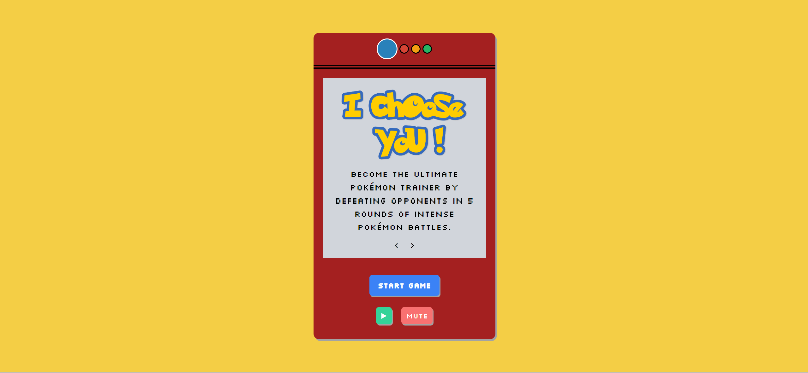
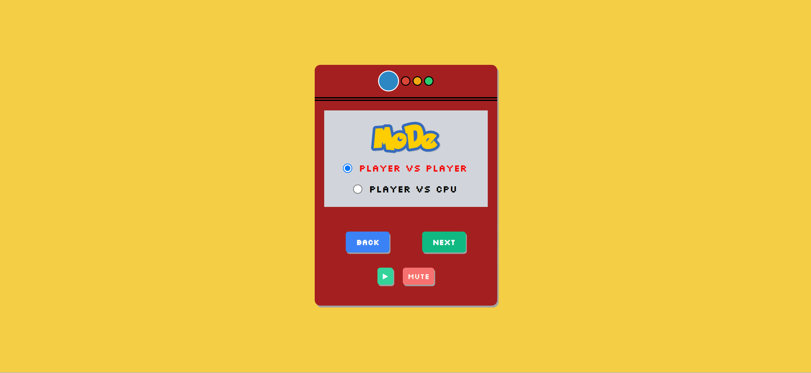
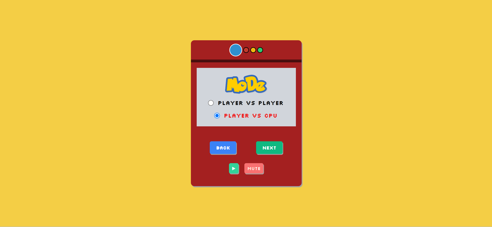
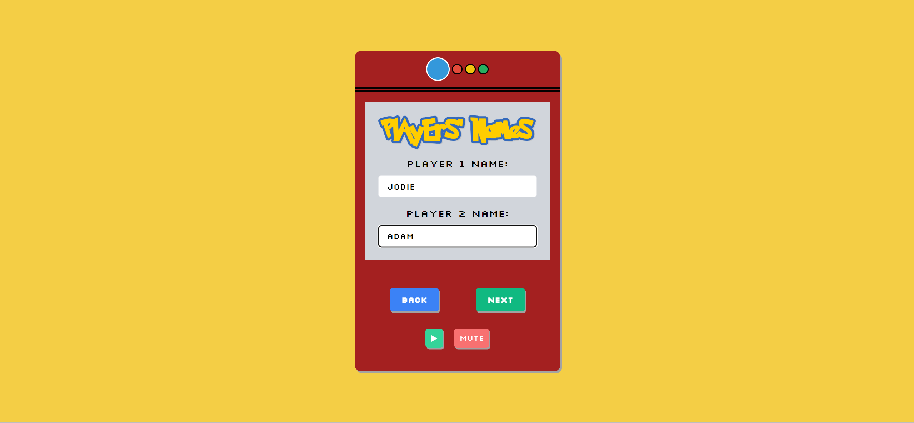
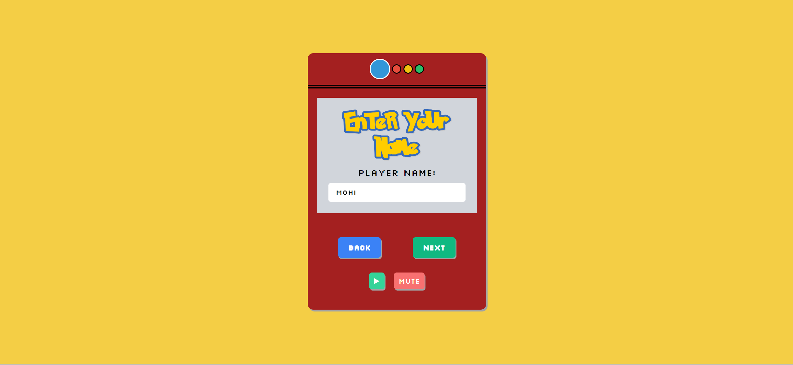
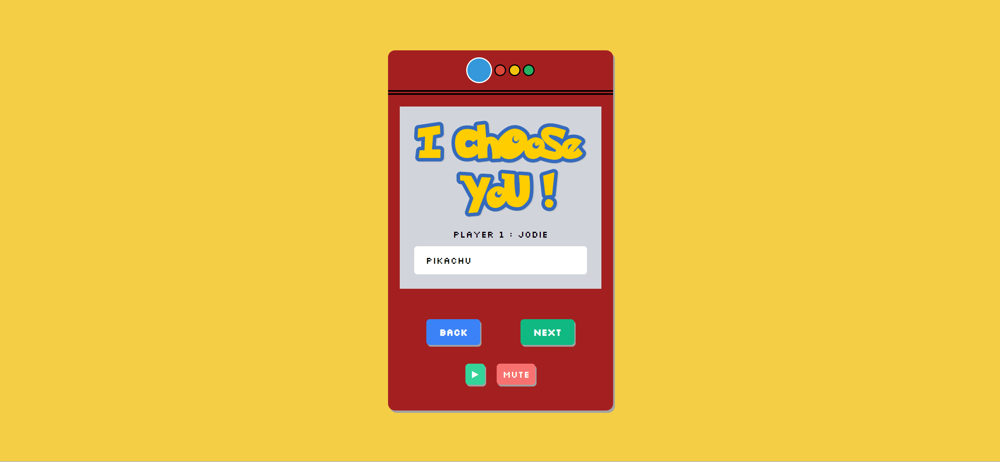
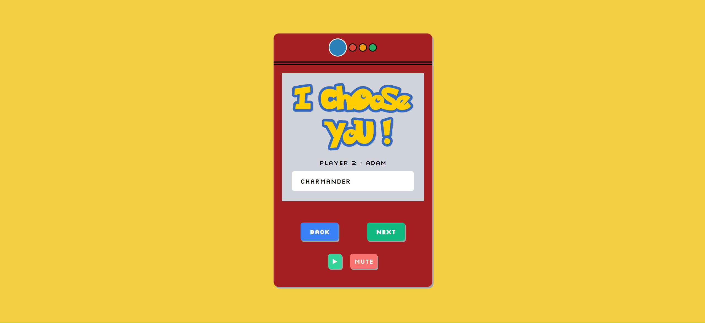
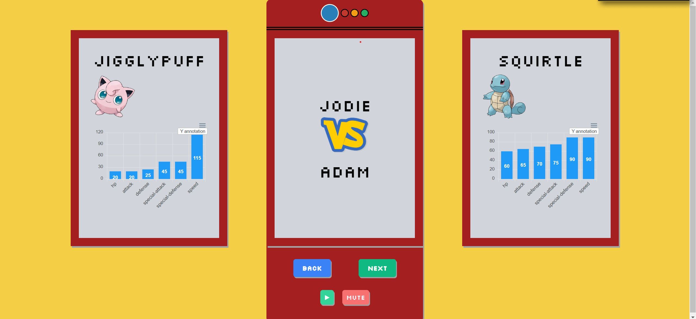
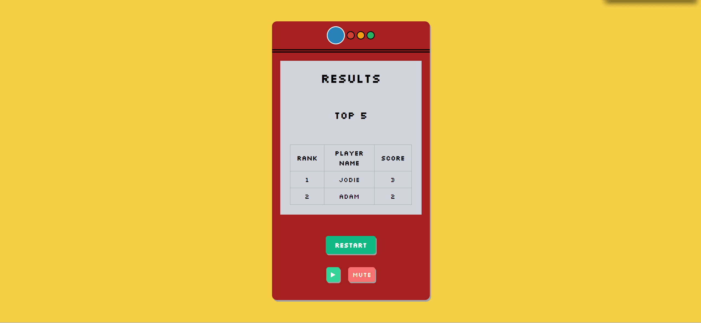

# I Choose You: Pokemon Battle Simulator

## Description

"I Choose You" is an interactive Pokemon battle simulator that allows users to test their Pokemon knowledge and battle skills. As a Pokemon trainer, users can choose their Pokemon, battle against friends or a computer opponent, and track their wins. The game features an introduction, Pokemon selection, battles, and a leaderboard to compare performance.

As young adults, we don’t have the time nor energy to play countless hours of pokemon on console, and thus the pokemon battle simulator was birthed to remind ourselves of our youth.

### Problem Solving

The project addresses the challenge of engaging users in a Pokemon battle simulation, combining Pokemon data from PokeApi. It provides a fun and competitive environment for users to showcase their Pokemon knowledge.

### Learning

Developers working on this project gain experience in integrating APIs, managing user input, implementing game logic, and utilizing local storage for data persistence. The project enhances skills in HTML, CSS, JavaScript, and collaboration within a team.

## Installation

To install and run this project locally, follow these steps:

1. Clone the repository to your local machine.
    
    git clone git@github.com:AdamIsitmez/I-Choose-You.git

2. Open the project folder in your code editor.
3. Explore the code and open index.html in your web browser.

## Usage

1. Click the "Start Game" button to initiate the Pokemon battle simulator.

    

    .gif)

2. Choose whether to play against another player or the computer.

    

    

3. Enter your name to personalize the game experience.

     

     

4. Select your Pokemon for battle. If playing against another player, each player selects a Pokemon.

    

    

5. The battle begins! The program determines the winner based on Pokemon damage.

     

     

6. After the battle, view the leaderboard to see your ranking and past performance.

    

## Live Demo

Check out the live demo of 'I Choose You' [here](https://adamisitmez.github.io/I-Choose-You/).

## Credits

- Project created by Group 3: 
  - Adam Isitmez
  - Jean Pierre
  - Jodie Lee
  - Mohibul Haque
- Pokemon data from [PokeApi](https://pokeapi.co/)
- Music provided and produced by [LonePeakMusic](https://www.youtube.com/@LonePeakMusic)
    - Song : Highway 1 - Retro Gaming Version [Royalty Free]
    - Video Link: [Upbeat Retro Gaming Background Music](https://www.youtube.com/watch?v=waaxFLLnRXg&list=PLsVfn9YIFmNC3SL_FgAe6k4_is4stMOh2&index=30)
- [Pokemon Font Generator](https://fontmeme.com/pokemon-font/)

## License
This project is licensed under the MIT License - see the [LICENSE](./LICENSE) file for details.

## How to Contribute

If you'd like to contribute to this project, please follow these guidelines:

1. Fork this project.
2. Create a new branch for your feature or bug fix.
3. Commit your changes.
4. Submit a pull request.

